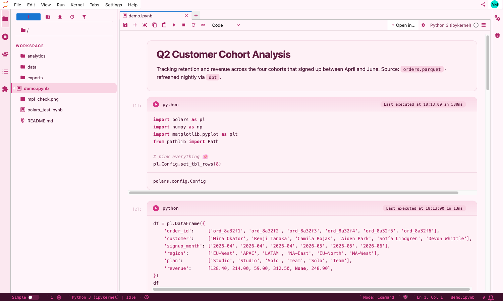
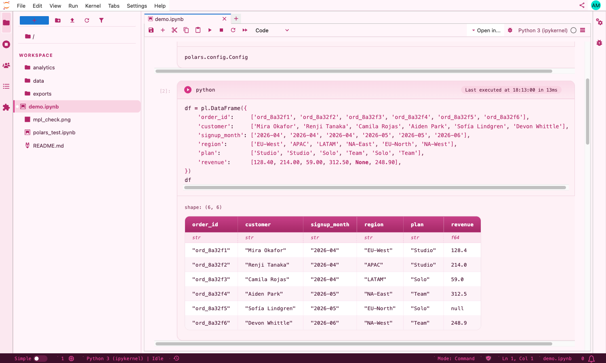
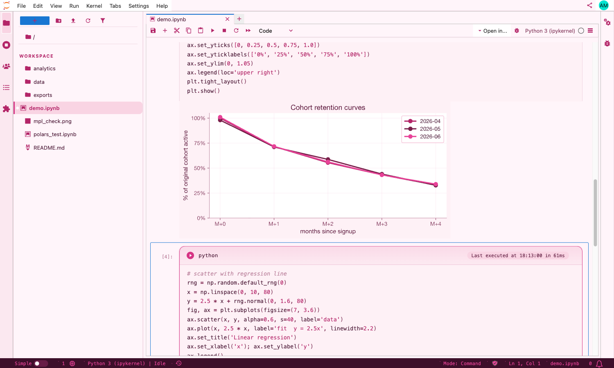
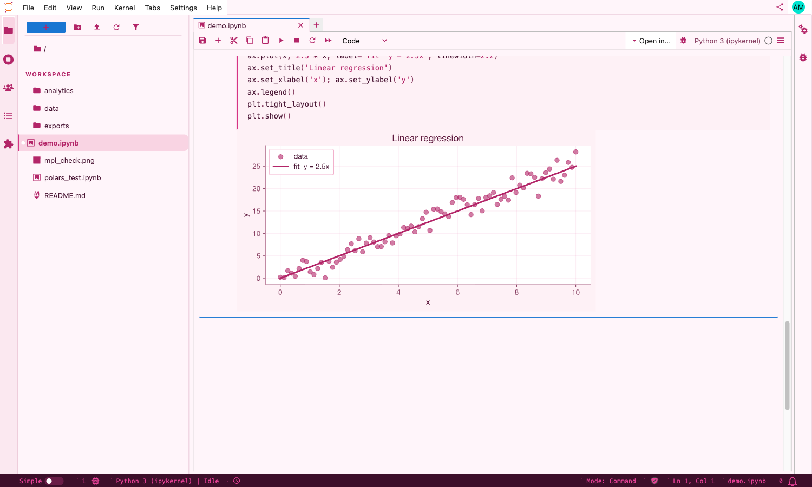

# 🌸 Pink Jupyter

> Data science, but pink. A cohesive light-pink theme for **JupyterLab** — card-style cells, polished `polars` & `pandas` tables, a matching `matplotlib` palette, and a dark-plum status bar with monospace text.



---

## What you get

- **Card-style cells** with a pink gradient header (play-dot + cell label + run-timer pill).
- **Markdown cards** with deep-plum headings and pink-pill inline code.
- **Polars & pandas tables** styled the same way: burgundy column header, italic dtype row, subtle column/row separators, alternating row tint.
- **Matplotlib palette** that blends with the cell output card (no white rectangle around your plots) — and a pink → burgundy → plum color cycle.
- **Sidebar** redesigned around a `WORKSPACE` label, pink-pill selected file, and pink folder/notebook icons.
- **Status bar** in dark plum with hot-pink monospace text and `·` separators between items.
- **Cell-execute-time** label hoisted into the cell header as a pink pill (works with the [`jupyterlab-execute-time`](https://github.com/deshaw/jupyterlab-execute-time) extension).

| Polars table | Cohort plot | Regression |
|---|---|---|
|  |  |  |

---

## Install

```bash
git clone https://github.com/alexandertsai/pink-jupyter.git
cd pink-jupyter
python install_theme.py            # interactive — pick a theme
```

Or non-interactively:

```bash
python install_theme.py --theme lab-light --yes
```

Then start JupyterLab with custom CSS enabled:

```bash
jupyter lab --custom-css
```

> Tip: alias it. Add `alias jupyter='jupyter lab --custom-css'` to your shell rc.

The installer drops three files (and backs up anything it overwrites):

| File | Purpose |
|---|---|
| `~/.jupyter/custom/custom.css`   | The Jupyter theme |
| `~/.matplotlib/matplotlibrc`     | Matplotlib defaults that match the theme |
| `~/.ipython/profile_default/startup/00-inline-svg.py` | SVG inline backend so plots are crisp |

### Available themes

```bash
$ python install_theme.py list

  1. Pink Light · Jupyter Lab           (recommended)
  2. Pink Dark  · Jupyter Lab
  3. Sage Blue Dark · Jupyter Lab
  4. Pink Light · Classic Notebook
  5. Pink Dark  · Classic Notebook
```

CLI flags:

```
--theme {lab-light,lab-dark,lab-sage,nb-light,nb-dark}   pick non-interactively
--yes / -y                                                overwrite without asking
--no-mpl                                                  skip matplotlibrc
--no-svg                                                  skip IPython SVG backend
```

---

## Optional: pink cursor for `jupyterlab-vim`

If you use [`jupyterlab-vim`](https://github.com/jupyterlab-contrib/jupyterlab-vim), normal mode draws a fat block cursor that defaults to `#77EE77` (vim green). Run this **after** `install_theme.py` to make it pink instead:

```bash
pip install jupyterlab-vim==4.1.4   # if you haven't already
python install_vim_cursor.py        # add the pink-cursor block to ~/.jupyter/custom/custom.css
```

Hard-reload JupyterLab in your browser (⌘⇧R / Ctrl⇧R) to pick up the change. The script appends a small marker-delimited block — re-running is idempotent, and `python install_vim_cursor.py --remove` takes it back out.

The styling lives in [`theme/vim.css`](theme/vim.css) and uses CSS variable fallbacks so it picks up the right pink for whichever theme you installed (light / dark / sage). It targets the selectors used by `@axlair/jupyterlab-vim` 4.1.4 (CodeMirror 6 + `@replit/codemirror-vim`); older versions used different cursor classes, so the add-on may not work on them.

---

## Demo

Open [`demo.ipynb`](demo.ipynb) and run all cells. You'll see:

1. A markdown card with inline-code pills.
2. A `polars` DataFrame with the column header, dtype row, and pink alternating rows.
3. Two matplotlib plots (cohort retention & a regression scatter) using the pink palette.

---

## Customize

The CSS is built around a single block of design tokens at the top of `theme/lablight.css`:

```css
:root {
  --pp-cream:        #fff5fa;   /* page bg */
  --pp-card:         #fef1f6;   /* cell card bg */
  --pp-pill:         #f9d4e3;   /* inline-code, pill chips */
  --pp-pink:         #d63384;   /* primary pink */
  --pp-pink-deep:    #b32568;   /* keywords, strings, numbers */
  --pp-pink-hot:     #e84298;   /* status-bar text */
  --pp-burgundy:     #7a1f4a;   /* operators, fit lines */
  --pp-plum-mid:     #5e1a3e;   /* H1 / titles */
  --pp-plum:         #3d0f2a;   /* status-bar bg */
  --pp-text:         #4a1735;
  --pp-text-mute:    #8a4365;
  --pp-text-faint:   #c08aa3;
}
```

Change the hex codes once and the whole theme — page, cards, syntax highlighting, sidebar, status bar — re-tints together. The matplotlib `pinklight.mplstyle` mirrors the same palette, so updating both keeps plots in sync.

The font stack is `Inter` (sans) + `JetBrains Mono` (code). Override `--pp-sans` / `--pp-mono` if you have a different preference.

---

## Tested with

| | Version |
|---|---|
| JupyterLab        | 4.4 |
| polars            | 1.40 |
| pandas            | 2.x |
| matplotlib        | 3.x |
| Browser           | Chrome, Safari (CSS uses `:has()` — Chrome 105+/Safari 15.4+) |

---

## Uninstall

```bash
python install_theme.py uninstall
```

This restores any `*.backup` files the installer made; if there were no backups, it just removes the files it added. To remove only the optional vim-cursor block while keeping the theme:

```bash
python install_vim_cursor.py --remove
```

---

## Notes

- **Windows**: native paths work, but if you hit rendering glitches, run JupyterLab from WSL.
- **Classic Notebook**: the `nb-light` / `nb-dark` themes are kept for `nbclassic` / older Jupyter Notebook installs. New designs target JupyterLab.
- **Cell run-timer**: the timer pill expects the [`jupyterlab-execute-time`](https://github.com/deshaw/jupyterlab-execute-time) extension. Without it the static `⇧ ⏎ to run` hint shows instead.

---

## License

MIT. Use it, fork it, paint your own data science pink.

<sub>Made with 💕 for the Jupyter community (and Allison).</sub>
